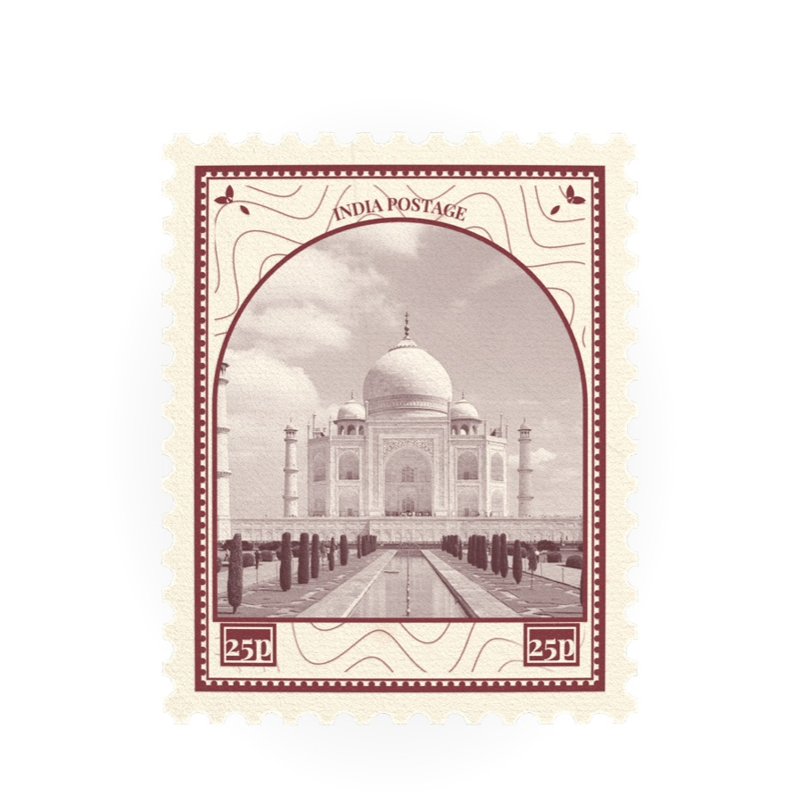
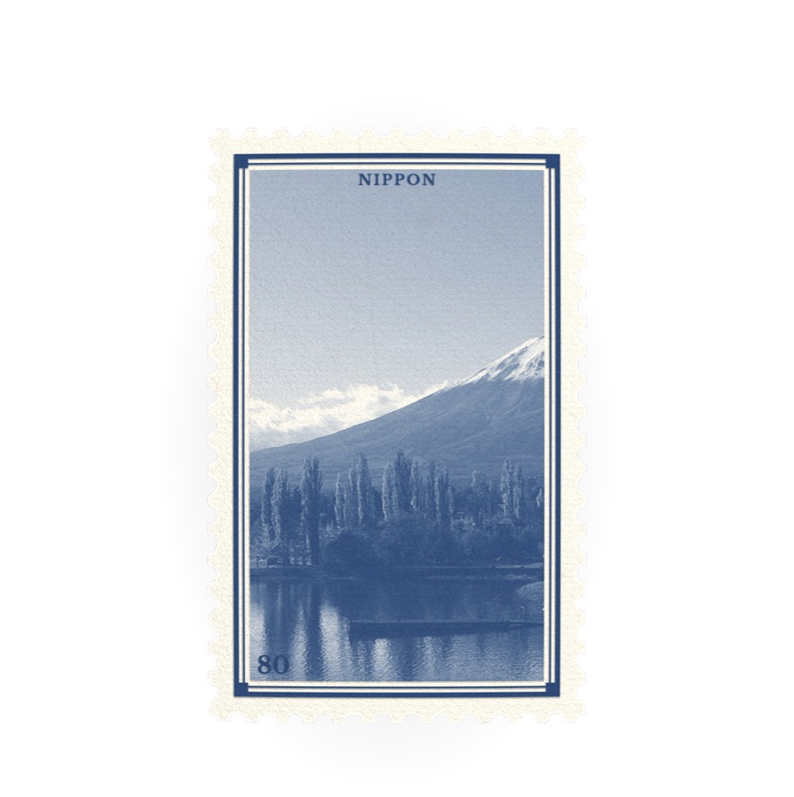
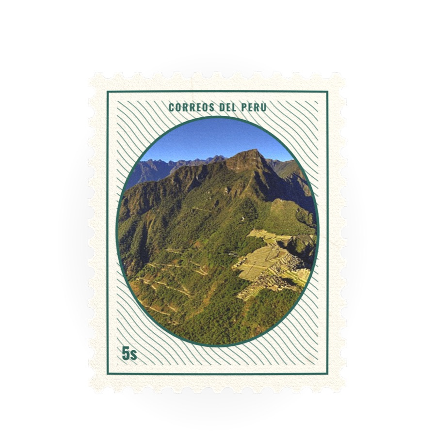
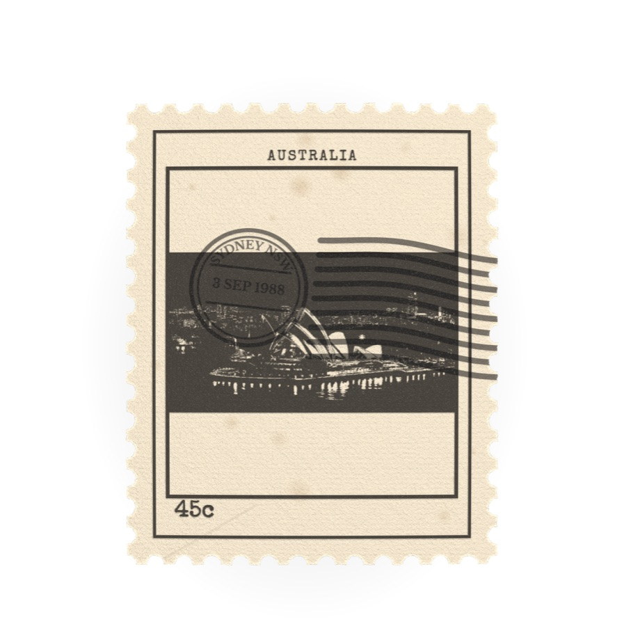
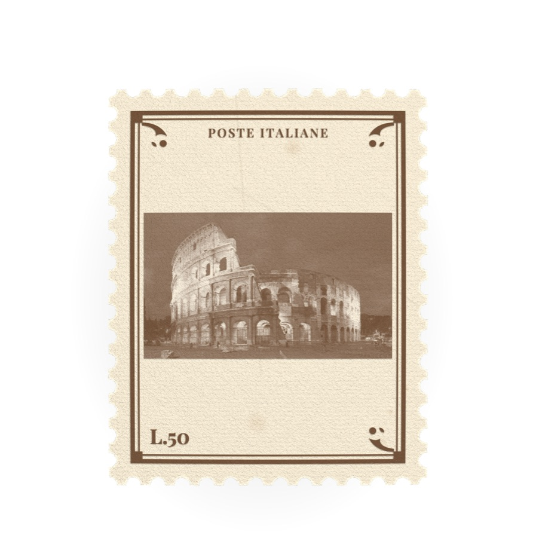
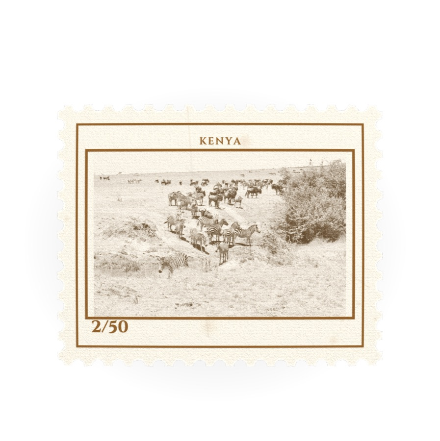
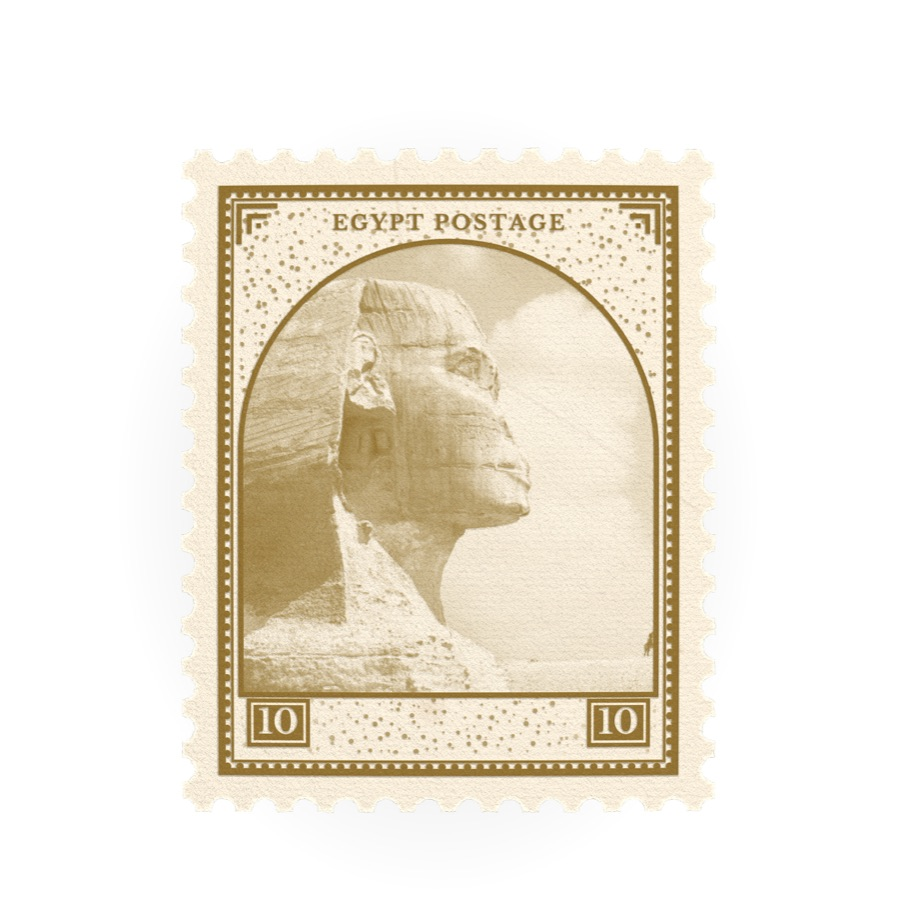
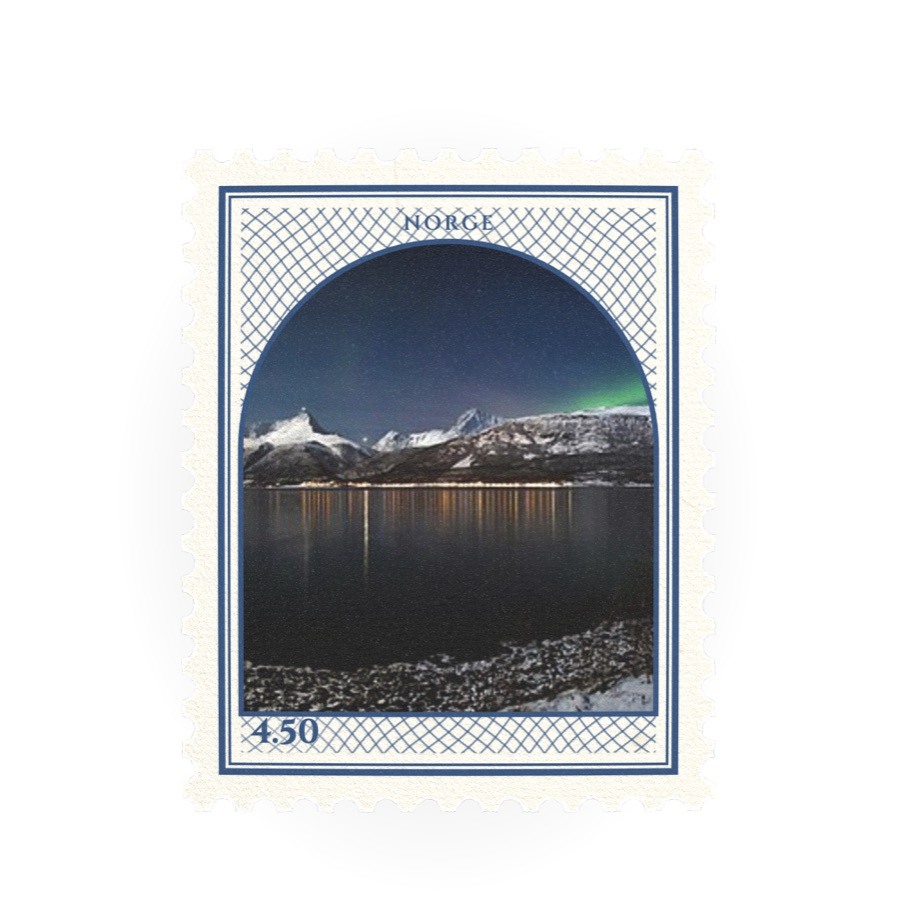

# The stamp is in the URL

Every setting except inscriptions is a query parameter, so a design is a link.
Open one and you get that stamp; move a slider and the link updates.

Only values that differ from the defaults are written. A stamp that changes six
things carries six parameters, not sixty, which is what keeps a shared link
short enough to paste.

## Artwork

Two ways to name a picture, and one that cannot be named.

| | |
|---|---|
| `template=<id>` | A bundled photograph: `beacon`, `national-park`, `wildlife`, `maritime`, `botanical`, `engineering`. |
| `art=<url>` | Any image on the web. Percent-encode it. |
| an uploaded file | **Not shareable.** A local file has no address, so uploading clears both parameters. |

`art` is fetched rather than assigned to an `img` element, which is what keeps
the canvas untainted so export still works. The consequence is that **the host
has to allow cross-origin reads**. `upload.wikimedia.org` and
`images.unsplash.com` both send `access-control-allow-origin: *`. A host that
does not will log one warning and the stamp renders without a picture in it.

A template named by the URL contributes its photograph only. Its preset is not
replayed, because the query string already carries whatever the sender had set
and replaying the preset would overwrite it.

## Parameters

Names match the fields in `src/lib/settings.ts`. Anything omitted takes its
default.

**Paper and edge**

| | |
|---|---|
| `format` | `portrait` `landscape` `square` `tall` `wide` |
| `size` | 0.3 to 1, stamp scale within the canvas |
| `edge` | `perforated` `wavy` `rouletted` `imperforate` |
| `gauge` | holes per 2cm, 7 to 16. 12 is common |
| `holeSize` | 0.2 to 0.55 |
| `tear` | 0 to 1, ragged fibre on the teeth |

**Age**

`toning` 0 to 1 (white to deep tan), `fiber`, `foxing`, `wear`, `watermark`,
all 0 to 1. Toning does most of the work; the rest are seasoning.

**Press**

| | |
|---|---|
| `print` | `engraved` `offset` `photogravure` `typeset` |
| `inkColor` | hex, percent-encoded, so `#7a2f36` is `%237a2f36` |
| `ink` | 0 to 2, ghost print to heavy plate |
| `relief` | 0 to 1, how far the ink stands off the paper |

**Furniture**

| | |
|---|---|
| `designOn` | `true`/`false`, draws frame, country and value at all |
| `frame` | `none` `rule` `classic` `ornate` `arched` |
| `frameColor` | hex |
| `typeface` | `serif` `didone` `grotesque` `condensed` `typewriter` `script` |
| `ornament` | `none` `scroll` `leaf` `deco` `rosette`, plus `ornamentSize` |
| `vignette` | `none` `rect` `arch` `oval` `circle`, plus `vignetteRule`, `vignetteColor`, `feather` |
| `country`, `caption` | text, plus `countryArc` to bend it over the vignette |
| `tablets`, `ribbon` | `true`/`false` |

**Ground**, the pattern filling the field inside the frame:

`ground` is `none` `guilloche` `burelage` `crosshatch` `panel` `stipple`
`halftone`, with `groundColor`, `groundWeight`, `groundScale`, `groundAngle`,
`groundStrength`, `groundClear` and `groundUnderArt`.

**Value and artwork placement**

`denomination`, `denomAnchor`, `denomPos`, `margin`, `artFit`
(`contain` `cover` `stretch`), `artBleed`, `artZoom`, `artPos`.

**Cancellation**

`postmarkOn`, `postmarkStyle` (`bars` `datestamp` `both` `grid`),
`postmarkCity`, `postmarkDate`, `postmarkAngle`, `postmarkPos`,
`postmarkStrength`.

**Presentation**

`scene` (`single` `envelope` `sheet`), `peelDirection`, `peelAmount`, `curl`,
`shadow`, `light`, `background`, `exportSize`.

**Pairs** are `x,y`: `denomPos=0.1,-0.05`, and the same for `artPos`,
`postmarkPos` and `light`.

## Three things that catch people

**The ink colour is not the only colour.** `inkColor` tints the artwork
separation. The frame, the vignette rule and the ground each have their own.
Set only `inkColor` and you get a red picture in a blue frame. Every example
below sets `inkColor`, `frameColor` and `vignetteColor` to the same value, plus
`groundColor` when there is a ground.

**Hexes need encoding.** `#` is `%23` in a query string. `inkColor=#7a2f36`
silently truncates; `inkColor=%237a2f36` works.

**A tall format letterboxes a wide photograph.** `artFit=contain` is the
default and leaves bands above and below. `artFit=cover` fills it, cropping
instead. The Japan example needs it.

## Inscriptions are not in the URL

Free lines of type have eleven fields each and no fixed count, and no flat
encoding of that stays readable. They live in React state, so a shared link
reproduces everything except lettering placed by hand.

## Examples

Each image links to the stamp that made it. The photographs are Creative
Commons from Wikimedia Commons, credited under each one.

### India

`INDIA POSTAGE` at `25p`, ink `#7a2f36`. `frame=ornate`, `vignette=arch`, `ground=guilloche`, `ornament=rosette`, `typeface=didone`, `tablets=true`, `ribbon=true`, `countryArc=true`, `print=photogravure`, `toning=0.3`.

Photograph: Taj Mahal, Agra, India edit2.jpg, CC BY-SA 4.0, via Wikimedia Commons.

### Japan

`NIPPON` at `80`, ink `#1d3f6e`. `frame=classic`, `format=tall`, `print=engraved`, `typeface=serif`, `relief=0.6`, `toning=0.18`, `artFit=cover`, `artZoom=1.1`.

Photograph: Mount Fuji 2013-11-13 (10863193853).jpg, CC BY 2.0, via Wikimedia Commons.

### Peru

`CORREOS DEL PERU` at `5s`, ink `#1f5c53`. `frame=rule`, `vignette=oval`, `ground=burelage`, `typeface=condensed`, `print=offset`, `toning=0.16`.

Photograph: 99 - Machu Picchu - Juin 2009.edit3.jpg, CC BY-SA 3.0, via Wikimedia Commons.

### Australia

`AUSTRALIA` at `45c`, ink `#3f3a33`. `frame=rule`, `vignette=rect`, `print=typeset`, `typeface=typewriter`, `postmarkOn=true`, `postmarkStyle=both`, `postmarkCity=SYDNEY NSW`, `postmarkDate=3 SEP 1988`, `toning=0.52`, `foxing=0.3`, `wear=0.45`.

Photograph: Sydney Opera House - Dec 2008.jpg, CC BY-SA 3.0, via Wikimedia Commons.

### Italy

`POSTE ITALIANE` at `L.50`, ink `#6b4a2f`. `frame=classic`, `ornament=scroll`, `typeface=didone`, `print=engraved`, `toning=0.44`, `fiber=0.6`.

Photograph: Colosseum in Rome-April 2007-1- copie 2B.jpg, CC BY-SA 2.5, via Wikimedia Commons.

### Kenya

`KENYA` at `2/50`, ink `#8a5a1f`. `frame=rule`, `format=landscape`, `vignette=rect`, `print=photogravure`, `typeface=grotesque`, `toning=0.22`.

Photograph: Zebras and wildebeest Maasai Mara.jpg, CC BY-SA 4.0, via Wikimedia Commons.

### Egypt

[](https://bhaumikmistry.github.io/stampstudio-bk/?art=https%3A%2F%2Fupload.wikimedia.org%2Fwikipedia%2Fcommons%2Fthumb%2Fc%2Fce%2FGreat_Sphinx_%2528%25D8%25A3%25D8%25A8%25D9%2588_%25D8%25A7%25D9%2584%25D9%2587%25D9%2588%25D9%2584%2529.jpg%2F960px-Great_Sphinx_%2528%25D8%25A3%25D8%25A8%25D9%2588_%25D8%25A7%25D9%2584%25D9%2587%25D9%2588%25D9%2584%2529.jpg&inkColor=%238a6a24&frameColor=%238a6a24&vignetteColor=%238a6a24&groundColor=%238a6a24&country=EGYPT+POSTAGE&denomination=10&frame=ornate&vignette=arch&ground=stipple&ornament=deco&typeface=serif&tablets=true&print=engraved&toning=0.38&background=white)

`EGYPT POSTAGE` at `10`, ink `#8a6a24`. `frame=ornate`, `vignette=arch`, `ground=stipple`, `ornament=deco`, `typeface=serif`, `tablets=true`, `print=engraved`, `toning=0.38`.

Photograph: Great Sphinx (أبو الهول).jpg, CC BY-SA 4.0, via Wikimedia Commons.

### Norway

[](https://bhaumikmistry.github.io/stampstudio-bk/?art=https%3A%2F%2Fupload.wikimedia.org%2Fwikipedia%2Fcommons%2Fthumb%2F6%2F60%2FAurora_borealis_above_Storfjorden_and_the_Lyngen_Alps_in_moonlight%252C_2012_March.jpg%2F960px-Aurora_borealis_above_Storfjorden_and_the_Lyngen_Alps_in_moonlight%252C_2012_March.jpg&inkColor=%232f4f7a&frameColor=%232f4f7a&vignetteColor=%232f4f7a&groundColor=%232f4f7a&country=NORGE&denomination=4.50&frame=arched&vignette=arch&ground=crosshatch&typeface=grotesque&print=offset&toning=0.14&background=white)

`NORGE` at `4.50`, ink `#2f4f7a`. `frame=arched`, `vignette=arch`, `ground=crosshatch`, `typeface=grotesque`, `print=offset`, `toning=0.14`.

Photograph: Aurora borealis above Storfjorden and the Lyngen Alps in moonlight, 2012 March.jpg, CC BY-SA 3.0, via Wikimedia Commons.

## Four looks

Once artwork is loaded the sidebar bakes four treatments of it, defined in
`src/lib/looks.ts`. Picking one writes its fields to the URL, so a variation is
a link like anything else. They are a decent starting vocabulary for a series:

| Look | What it sets |
|---|---|
| Engraved | `print=engraved`, `frame=classic`, no ground, one ink |
| Ornate | `print=photogravure`, `frame=ornate`, `vignette=arch`, `ground=guilloche`, tablets and ribbon |
| Airmail | `print=offset`, `vignette=oval`, `ground=burelage`, `typeface=condensed` |
| Cancelled | `print=typeset`, `postmarkOn=true`, heavy `toning`, `foxing` and `wear` |

A look leaves `country`, `denomination` and `caption` alone, so the thumbnails
show your stamp four ways rather than four generic ones.

